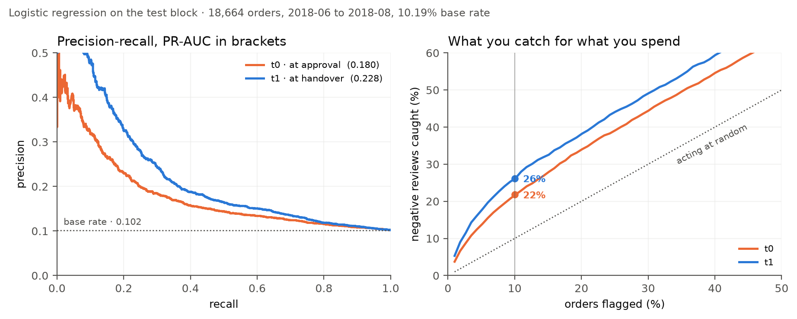
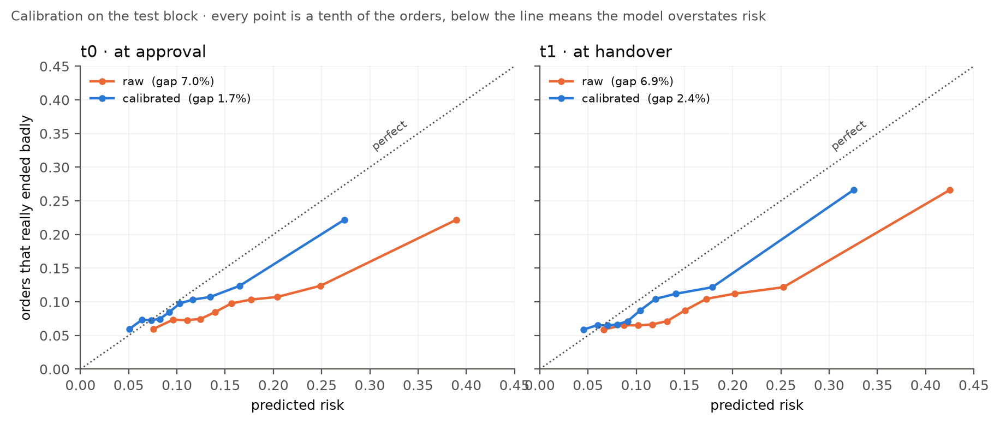
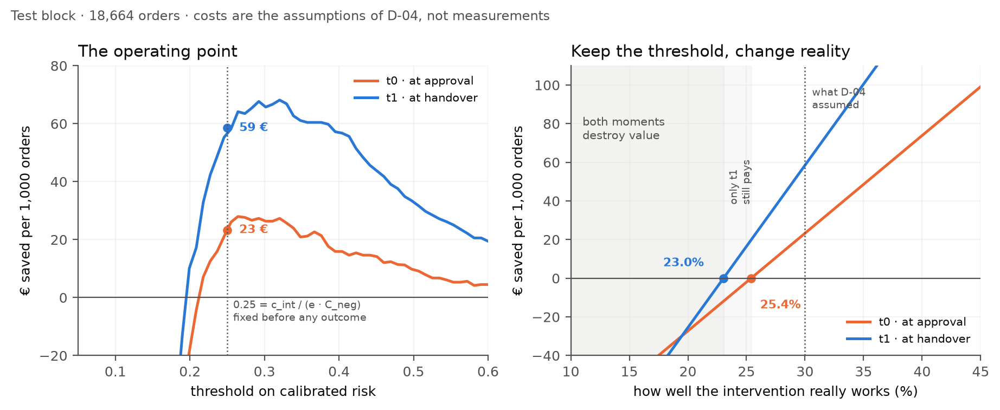

# ecommerce-review-risk

Predicting which e-commerce orders will end in a 1–2 star review, early enough to act on it.
Temporal validation, cost-optimized threshold, estimated impact in euros.

> **Status:** Phase 1 complete — temporal validation, a model chosen against a pre-registered
> bar, calibrated probabilities, and a cost case with the boundary where it stops paying.

---

## The problem

On a marketplace, a 1–2 star review costs the margin on the order plus reputational damage
to the seller. Intervening beforehand — a proactive notice, a goodwill coupon, logistics
prioritisation — costs considerably less.

**Question:** which orders will end in a negative review, early enough to do something about it?

**Target:** `review_score <= 2`, binary. Measured prevalence: **13.4%** over the 96,636
orders that reached both decision moments.

### Two decision moments

The core of the project is that the same question is asked twice, at two points where the
business could actually act, and the two are compared side by side.

| Moment | When | Information available | Trade-off |
|---|---|---|---|
| **t₀** | Order approved | Price, category, seller, buyer–seller distance, payment method, promised delivery window | Weaker signal, wide action window |
| **t₁** | Shipment dispatched | Everything from t₀ + carrier, actual dispatch date, deviation from the promised window | Much better signal, narrow window |

Quantifying what the extra information at t₁ is worth — and whether it arrives too late to
be useful — is the point of the exercise.

## What the data says

Negative reviews are not spread evenly over time. Prevalence swings between 9.9% and 22.1%
month to month, and it tracks the delivery-delay rate almost one to one — monthly r = **0.87**.
Two episodes stand out: Black Friday 2017, and a delivery collapse in February–March 2018 that
happened at entirely ordinary order volume.


| Delivery outcome | Negative reviews |
|---|---|
| Delivered on time | 9.2% |
| Delivered late | **54.0%** |
| Never delivered | **69.4%** |


Whether an order arrives late is only known afterwards, so the modelling job at t₀ and t₁ is to
predict *delay risk* from what is visible at the time: promised lead time, distance, seller
history, how fast the parcel reaches the carrier.

That instability also decides where the temporal split is cut — both crises sit in training,
while validation and test share a calm regime so a threshold calibrated on one transfers to the
other. Test prevalence is **10.19%**, and every test metric is read against that figure rather
than the overall 13.4%. Full analysis in [`notebooks/01_eda.ipynb`](notebooks/01_eda.ipynb);
reasoning in [`docs/decisiones.md`](docs/decisiones.md) D-08.

## Results

Read once on the test block — 18,664 orders from 2018-06 to 2018-08, base rate **10.19%** —
after every choice had been frozen on validation.



| Model | Moment | PR-AUC | recall@10% | lift@10% |
|---|---|---|---|---|
| **Logistic regression** | **t₀** | **0.1802** | 21.8% | 2.18× |
| LightGBM | t₀ | 0.1626 | 20.0% | 2.00× |
| Best single feature | t₀ | 0.1277 | 14.2% | 1.42× |
| Constant rule (the floor) | t₀ | 0.1019 | 9.9% | 0.99× |
| **Logistic regression** | **t₁** | **0.2281** | 26.1% | 2.61× |
| LightGBM | t₁ | 0.2092 | 24.6% | 2.46× |
| Best single feature | t₁ | 0.1624 | 19.8% | 1.98× |

**Acting on the 10% of orders the model ranks riskiest catches 21.8% of the negative reviews at
approval, and 26.1% once the parcel has been handed to the carrier — against 9.9% for acting at
random.** The handover is worth **+0.048 PR-AUC** [+0.038, +0.059], and that gap is *twice* what
validation suggested: normalised by each block's base rate, t₀ decays from 1.97× to 1.77× while
t₁ holds at 2.24×. Signal about how this particular shipment is behaving travels between periods
better than signal about what kind of order it is.

### Three findings worth more than the metrics

**The complex model lost, and the rule that said so was written first.** The bar LightGBM had to
clear was fixed in [D-12](docs/decisiones.md) *before it was trained*: higher PR-AUC, a bootstrap
interval excluding zero, and a gap large enough to matter operationally. It cleared the first and
failed the rest. On the test block it then lost outright, −0.018 PR-AUC [−0.032, −0.007]. Had the
rule been "whichever scores higher on validation", this project would have shipped the worse
model.

**The signal is additive, and that took two attempts to establish.** Cutting the features into
deciles to let a linear model bend cost 0.035–0.046 PR-AUC. A tree free to build any conjunction
it likes found nothing worth 0.01, and overfits from round 25 on. Neither curvature nor
interactions were hiding here.

**The models are miscalibrated, with proof.** The constant rule scores a better Brier (0.0935)
than the t₀ logistic (0.0961): a model trained at a 14.70% base rate systematically over-predicts
on a 10.19% block. Ranking well and being right about the probability are different things, which
is why no euro figure appears above. Calibration is the first task of the next session.

## The business case

Euros come from multiplying a probability by a cost, so the probabilities are corrected first.
A sigmoid calibrator fitted on validation — never on training, where the model has already seen
the labels — brings predicted risk from 17.2% down to 11.5% on a block whose real rate is 10.2%.



Before calibration the constant rule scored a *better* Brier than the t₀ model. After it, both
models beat it. A residual bias is left in place on purpose: the calibrator learns an 11.86%
block and is applied to a 10.19% one, because the drift does not stop. That is a monitoring
problem, not a calibration one.

### Blanket intervention destroys value

Acting costs €3 per order and saves €12 on the ones that would have gone wrong — 10.19% of them.
Intervening on everybody loses **€33,180** on the test block. That number, not any metric, is
what the model exists to fix.

### Acting above the threshold

`p* = c_int / (e · C_neg)` = **0.25**, derived from the cost ratio before any outcome was seen.

| Moment | Flagged | Precision | Recall | Saved | Per 1,000 orders |
|---|---|---|---|---|---|
| t₀ | 799 (4.3%) | 29.5% | 12.4% | €435 | €23.31 |
| t₁ | 1,204 (6.5%) | 32.6% | 20.6% | €1,092 | €58.51 |

t₁ saves 2.5× what t₀ saves — roughly €4,400 a year against €1,700 at this volume. That is little
money, and the honest framing matters more than the figure: it scales linearly with volume and
with `C_neg`, and the policy is deliberately narrow, since only 4–6% of orders clear the bar.



### Where it stops paying

Re-derive the threshold when an assumption changes and the policy cannot lose money — it just
raises the bar until nothing clears it. At `C_neg` = €15 and 15% effectiveness it flags no orders
at all: the programme does not fail, it disappears.

The realistic failure is keeping the threshold while reality differs. Savings are then linear in
effectiveness and cross zero at `e* = c_int / (C_neg × precision)` — a frontier independent of
block size and base rate.

| Moment | Precision | Stops paying below |
|---|---|---|
| t₀ | 29.5% | e = **0.254**, or `C_neg` = €33.9, or `c_int` above €3.54 |
| t₁ | 32.6% | e = **0.230**, or `C_neg` = €30.7, or `c_int` above €3.91 |

**0.30 was assumed, and t₀ breaks even at 0.254.** The case holds, and it holds narrowly — which
is structural, not a defect: the threshold sits exactly at break-even, so the marginal flagged
order contributes nothing by construction.

Which points somewhere that is not the model:

> Before building this for real, **measure the effectiveness of the intervention** with a
> controlled experiment. An A/B over a few thousand flagged orders answers the one question
> everything rests on, and no improvement in PR-AUC substitutes for it.

And it gives the honest reason to keep improving the model: raising precision at the operating
point from 32.6% to 40% moves the break-even from 23.0% to **18.8%**. That is buying margin
against an assumption nobody has measured — a claim an operations director can act on, in a way
a PR-AUC cannot be.

### One more finding, from t₀ versus t₁

The fixed cost matrix compares the two moments on information alone, which is the right way to
measure and the wrong way to decide: at t₀ nothing has moved and there are real levers, while at
t₁ only goodwill is left. Holding t₁ at 0.30 and letting t₀ be more effective, the two cross at
about **0.44** — t₁'s signal advantage of +0.048 PR-AUC is cancelled if intervening at approval
is some 14 points more effective than intervening after dispatch. Whether it is, this dataset
cannot say.

## Methodological commitments

These are deliberate constraints, not defaults. They are what the project is actually about.

- **Temporal split.** Train on earlier months, evaluate on later ones. Never a random split.
- **No temporal leakage.** No feature may use information from after the moment of
  prediction. The actual delivery date exists at neither t₀ nor t₁.
- **Backward-looking aggregates.** Any seller or product statistic (historical rating,
  volume, late-delivery rate) is computed only from orders *prior* to the one being scored.
  This is the quietest source of leakage there is.
- **Feature availability is documented.** [`docs/features.md`](docs/features.md) maps every
  feature to the moment it becomes available.
- **Baselines first.** A trivial rule, then logistic regression. The complex model has to
  beat them by an explicit margin or it is not justified.
- **PR-AUC and recall@k**, always reported alongside prevalence. Accuracy appears only as an
  example of why it is the wrong metric here.
- **No resampling by default.** No SMOTE, no class weights in the main line. Class imbalance
  is handled through a threshold optimised on expected cost.
- **Calibration is mandatory.** Without calibrated probabilities, any euro figure is fiction.
  Calibration curve and Brier score are reported.
- **Fixed seeds** everywhere randomness is involved.

## Cost model

The threshold is chosen by expected cost, which requires a cost matrix. The dataset does not
contain one — Olist does not publish what a negative review costs. The figures below are
**documented assumptions**, not measurements, and a sensitivity analysis over all of them is
part of the deliverable.

| Parameter | Value | Basis |
|---|---|---|
| Intervention cost `c_int` | €3 | €5 coupon at ~60% redemption |
| Negative review cost `C_neg` | €40 | €10 margin at risk + €30 downstream effect |
| Intervention effectiveness `e` | 0.30 | Deliberately conservative |

Acting on an order with probability `p` of a negative review pays off when
`p > c_int / (e · C_neg)`, which gives a threshold of **0.25** against a measured base rate
of 13.4% — acting on the segment carrying roughly 1.9x the baseline risk.
Note that the threshold depends only on the *ratio*, not on the absolute levels.

What these assumptions turn into, and how much of it survives changing them, is in
[The business case](#the-business-case) above.

Full reasoning, decomposition and sensitivity plan: [`docs/decisiones.md`](docs/decisiones.md)
(in Spanish).

## Getting started

### Prerequisites

- **Linux or WSL2.** The project is developed on Ubuntu 24.04. It will not build on Windows
  with Smart App Control enabled, which blocks the unsigned native extension modules that
  every scientific Python wheel ships — see `docs/decisiones.md`, D-01.
- **`libgomp1`** — the OpenMP runtime LightGBM loads at import time. Not present in minimal
  Ubuntu images:
  ```bash
  sudo apt-get install -y libgomp1
  ```
- **[uv](https://docs.astral.sh/uv/)** — manages both the Python 3.11 interpreter and the
  dependencies.

### Install

```bash
uv sync
```

This creates a virtual environment from `uv.lock`, so the dependency versions are exactly
the ones the project was developed against. A derived `requirements.txt` is also provided
for anyone who prefers plain `pip`.

### Get the data

The dataset is not committed (~120 MB, CC BY-NC-SA 4.0). Two options:

**Automatic** — copy `.env.example` to `.env` and add a Kaggle API token from
[kaggle.com/settings/api](https://www.kaggle.com/settings/api), then:

```bash
make data
```

**Manual** — download the
[Brazilian E-Commerce Public Dataset by Olist](https://www.kaggle.com/datasets/olistbr/brazilian-ecommerce)
and unzip the nine CSVs into `data/raw/`. Everything downstream works the same; `make data`
will verify the files against `data/manifest.json` either way.

### Common tasks

```bash
make help     # list all targets
make data     # download and verify the dataset
make train    # train the models
make eval     # metrics and cost-optimised threshold
make test     # run the test suite
make lint     # ruff check and format
```

## Layout

```
├── data/              # not committed; raw / interim / processed
├── docs/
│   ├── problema.md    # business question, target, cost matrix
│   ├── decisiones.md  # decision log with rationale
│   └── features.md    # feature -> moment of availability
├── notebooks/         # 01_eda, 02_signal, 03_baseline, 04_model, 05_business
├── src/               # importable package; all logic lives here
├── tests/
└── reports/figures/   # figures embedded in this README
```

Notebooks tell the story; `src/` is what runs. No business logic lives only in a cell.

## Roadmap

| Phase | Scope | Status |
|---|---|---|
| 1 | Tabular risk: t₀ vs t₁, calibration, euro impact, reproducible repo | **Complete** |
| 2 | NLP on review text: complaint reason, embeddings, aspect extraction with an LLM vs a classical classifier, with cost and latency measured | Planned |
| 3 | Serving: FastAPI, container, public Streamlit demo | Planned |
| 4 | Operations: month-to-month drift, retraining, MLflow | Planned |

## Data

[Brazilian E-Commerce Public Dataset by Olist](https://www.kaggle.com/datasets/olistbr/brazilian-ecommerce)
— roughly 100,000 orders across 9 related tables, 2016–2018. Licensed CC BY-NC-SA 4.0.
