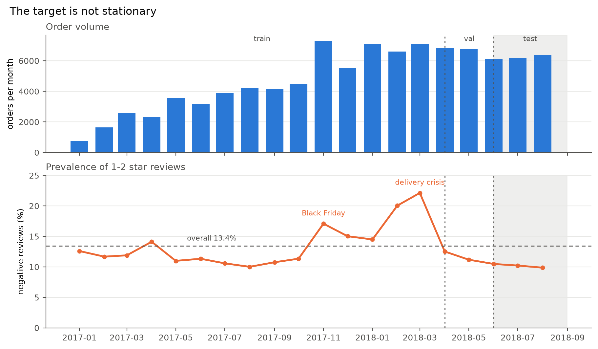
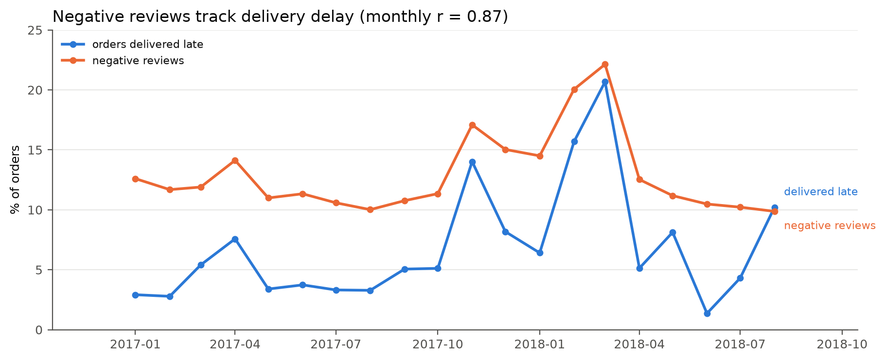

# ecommerce-review-risk

Predicting which e-commerce orders will end in a 1–2 star review, early enough to act on it.
Temporal validation, cost-optimized threshold, estimated impact in euros.

> **Status:** Phase 1 in progress — project scaffolding and data pipeline.
> No modelling results yet. This notice is removed once there are numbers to report.

---

## The problem

On a marketplace, a 1–2 star review costs the margin on the order plus reputational damage
to the seller. Intervening beforehand — a proactive notice, a goodwill coupon, logistics
prioritisation — costs considerably less.

**Question:** which orders will end in a negative review, early enough to do something about it?

**Target:** `review_score <= 2`, binary. Measured prevalence: **13.4%** over the 96,636
orders that reached both decision moments.

### Two decision moments

The core of the project is that the same question is asked twice, at two points where the
business could actually act, and the two are compared side by side.

| Moment | When | Information available | Trade-off |
|---|---|---|---|
| **t₀** | Order approved | Price, category, seller, buyer–seller distance, payment method, promised delivery window | Weaker signal, wide action window |
| **t₁** | Shipment dispatched | Everything from t₀ + carrier, actual dispatch date, deviation from the promised window | Much better signal, narrow window |

Quantifying what the extra information at t₁ is worth — and whether it arrives too late to
be useful — is the point of the exercise.

## What the data says

Negative reviews are not spread evenly over time. Prevalence swings between 9.9% and 22.1%
month to month, and it tracks the delivery-delay rate almost one to one — monthly r = **0.87**.
Two episodes stand out: Black Friday 2017, and a delivery collapse in February–March 2018 that
happened at entirely ordinary order volume.



| Delivery outcome | Negative reviews |
|---|---|
| Delivered on time | 9.2% |
| Delivered late | **54.0%** |
| Never delivered | **69.4%** |



Whether an order arrives late is only known afterwards, so the modelling job at t₀ and t₁ is to
predict *delay risk* from what is visible at the time: promised lead time, distance, seller
history, how fast the parcel reaches the carrier.

That instability also decides where the temporal split is cut — both crises sit in training,
while validation and test share a calm regime so a threshold calibrated on one transfers to the
other. Test prevalence is **10.19%**, and every test metric is read against that figure rather
than the overall 13.4%. Full analysis in [`notebooks/01_eda.ipynb`](notebooks/01_eda.ipynb);
reasoning in [`docs/decisiones.md`](docs/decisiones.md) D-08.

## Methodological commitments

These are deliberate constraints, not defaults. They are what the project is actually about.

- **Temporal split.** Train on earlier months, evaluate on later ones. Never a random split.
- **No temporal leakage.** No feature may use information from after the moment of
  prediction. The actual delivery date exists at neither t₀ nor t₁.
- **Backward-looking aggregates.** Any seller or product statistic (historical rating,
  volume, late-delivery rate) is computed only from orders *prior* to the one being scored.
  This is the quietest source of leakage there is.
- **Feature availability is documented.** [`docs/features.md`](docs/features.md) maps every
  feature to the moment it becomes available.
- **Baselines first.** A trivial rule, then logistic regression. The complex model has to
  beat them by an explicit margin or it is not justified.
- **PR-AUC and recall@k**, always reported alongside prevalence. Accuracy appears only as an
  example of why it is the wrong metric here.
- **No resampling by default.** No SMOTE, no class weights in the main line. Class imbalance
  is handled through a threshold optimised on expected cost.
- **Calibration is mandatory.** Without calibrated probabilities, any euro figure is fiction.
  Calibration curve and Brier score are reported.
- **Fixed seeds** everywhere randomness is involved.

## Cost model

The threshold is chosen by expected cost, which requires a cost matrix. The dataset does not
contain one — Olist does not publish what a negative review costs. The figures below are
**documented assumptions**, not measurements, and a sensitivity analysis over all of them is
part of the deliverable.

| Parameter | Value | Basis |
|---|---|---|
| Intervention cost `c_int` | €3 | €5 coupon at ~60% redemption |
| Negative review cost `C_neg` | €40 | €10 margin at risk + €30 downstream effect |
| Intervention effectiveness `e` | 0.30 | Deliberately conservative |

Acting on an order with probability `p` of a negative review pays off when
`p > c_int / (e · C_neg)`, which gives a threshold of **0.25** against a measured base rate
of 13.4% — acting on the segment carrying roughly 1.9x the baseline risk.
Note that the threshold depends only on the *ratio*, not on the absolute levels.

Full reasoning, decomposition and sensitivity plan: [`docs/decisiones.md`](docs/decisiones.md)
(in Spanish).

## Getting started

### Prerequisites

- **Linux or WSL2.** The project is developed on Ubuntu 24.04. It will not build on Windows
  with Smart App Control enabled, which blocks the unsigned native extension modules that
  every scientific Python wheel ships — see `docs/decisiones.md`, D-01.
- **`libgomp1`** — the OpenMP runtime LightGBM loads at import time. Not present in minimal
  Ubuntu images:
  ```bash
  sudo apt-get install -y libgomp1
  ```
- **[uv](https://docs.astral.sh/uv/)** — manages both the Python 3.11 interpreter and the
  dependencies.

### Install

```bash
uv sync
```

This creates a virtual environment from `uv.lock`, so the dependency versions are exactly
the ones the project was developed against. A derived `requirements.txt` is also provided
for anyone who prefers plain `pip`.

### Get the data

The dataset is not committed (~120 MB, CC BY-NC-SA 4.0). Two options:

**Automatic** — copy `.env.example` to `.env` and add a Kaggle API token from
[kaggle.com/settings/api](https://www.kaggle.com/settings/api), then:

```bash
make data
```

**Manual** — download the
[Brazilian E-Commerce Public Dataset by Olist](https://www.kaggle.com/datasets/olistbr/brazilian-ecommerce)
and unzip the nine CSVs into `data/raw/`. Everything downstream works the same; `make data`
will verify the files against `data/manifest.json` either way.

### Common tasks

```bash
make help     # list all targets
make data     # download and verify the dataset
make train    # train the models
make eval     # metrics and cost-optimised threshold
make test     # run the test suite
make lint     # ruff check and format
```

## Layout

```
├── data/              # not committed; raw / interim / processed
├── docs/
│   ├── problema.md    # business question, target, cost matrix
│   ├── decisiones.md  # decision log with rationale
│   └── features.md    # feature -> moment of availability
├── notebooks/         # 01_eda, 02_signal, 03_baseline, 04_model, 05_business
├── src/               # importable package; all logic lives here
├── tests/
└── reports/figures/   # figures embedded in this README
```

Notebooks tell the story; `src/` is what runs. No business logic lives only in a cell.

## Roadmap

| Phase | Scope | Status |
|---|---|---|
| 1 | Tabular risk: t₀ vs t₁, calibration, euro impact, reproducible repo | In progress |
| 2 | NLP on review text: complaint reason, embeddings, aspect extraction with an LLM vs a classical classifier, with cost and latency measured | Planned |
| 3 | Serving: FastAPI, container, public Streamlit demo | Planned |
| 4 | Operations: month-to-month drift, retraining, MLflow | Planned |

## Data

[Brazilian E-Commerce Public Dataset by Olist](https://www.kaggle.com/datasets/olistbr/brazilian-ecommerce)
— roughly 100,000 orders across 9 related tables, 2016–2018. Licensed CC BY-NC-SA 4.0.
